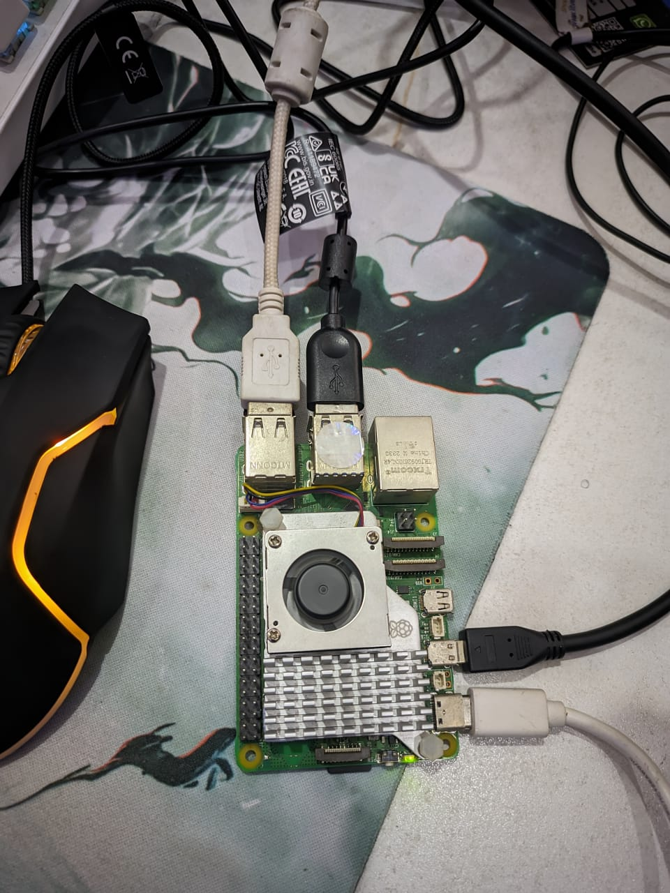
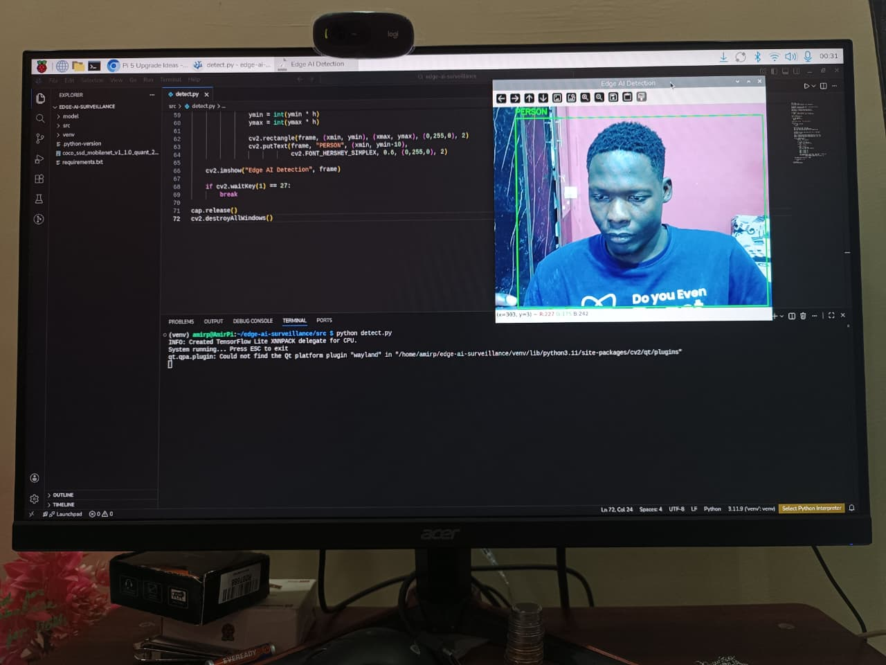
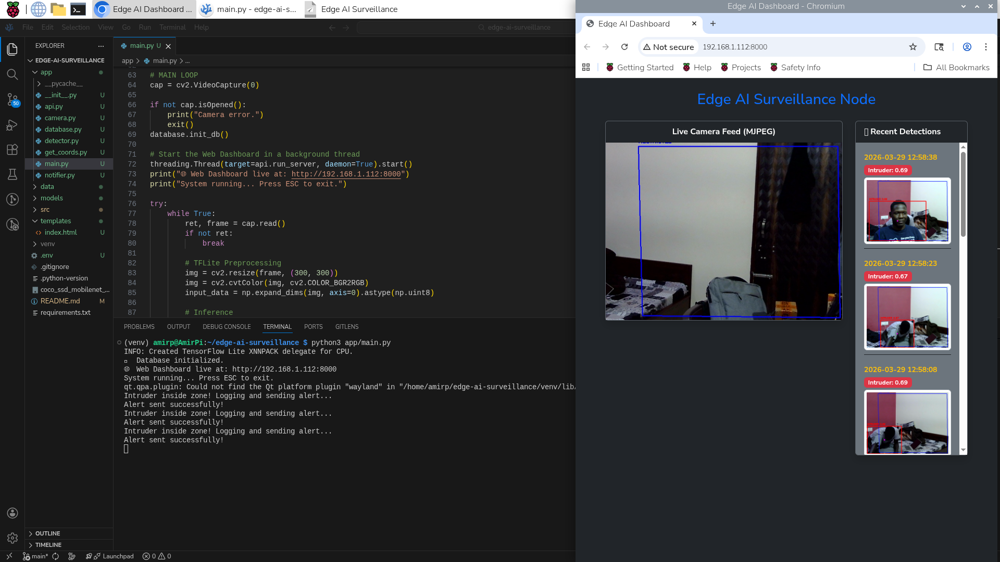
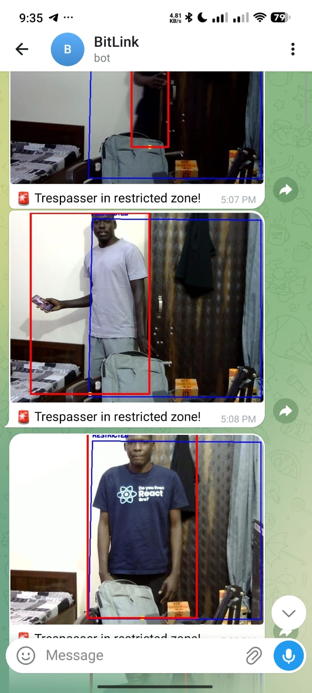

# Edge AI Smart Surveillance System

A real-time, stateful **Edge AI-powered surveillance system** built for the Raspberry Pi. It performs on-device human detection, utilizes spatial logic for virtual tripwires, serves a live local web dashboard, and sends instant asynchronous alerts via Telegram-all without relying on cloud processing.

---

##  Overview

This project demonstrates how to build an **enterprise-grade, privacy-focused security microservice** using:

*  **Local AI Inference:** TensorFlow Lite for low-latency edge processing.
*  **Spatial Logic:** Virtual restricted zones to eliminate false positives and alert fatigue.
*  **Stateful Logging:** SQLite database for persistent threat history.
*  **Live Dashboard:** FastAPI server streaming MJPEG video to local browsers.
*  **Asynchronous Alerting:** Threaded Telegram Bot API integration to prevent camera freezing.

---

##  Key Features

*  **Real-Time Human Detection:** Powered by a lightweight MobileNet SSD model.
*  **Virtual Tripwires:** Multi-point checking (Feet + Center of Mass) triggers alerts *only* when an intruder enters a user-defined zone.
*  **FastAPI Web Dashboard:** View live camera feeds and historical database logs on your local Wi-Fi.
*  **Local Database Logging:** Automatically saves high-res incident snapshots and logs them to SQLite.
*  **Threaded Telegram Alerts:** In-memory image encoding pushes alerts instantly without dropping video frames.
*  **Fully Offline Inference:** No cloud APIs required for detection.

---

##  System Architecture


**Pipeline:**
Camera → Preprocessing → TFLite Inference → **Spatial Logic Engine** → *(If Threat Detected)* → **Threaded Telegram Alert** & **SQLite Log** → **FastAPI Web Stream**

---

## Tech Stack

| Component | Technology |
| :--- | :--- |
| **Edge Device** | Raspberry Pi 5 |
| **Backend & API** | Python 3.11, FastAPI, Uvicorn |
| **Computer Vision** | OpenCV, NumPy |
| **AI Model** | TensorFlow Lite (MobileNet SSD) |
| **Database** | SQLite3 |
| **Alerting** | Telegram Bot API, python-dotenv |

---

## 📁 Project Structure

```text
edge-ai-surveillance/
│
├── app/                        #  Core application code
│   ├── main.py                 # Entry point: ML, Camera, and Logic
│   ├── api.py                  # FastAPI web server and stream generator
│   ├── database.py             # SQLite initialization and logging
│   └── get_coords.py           # GUI calibration tool for tripwires
│
├── src/                        #  Alternative scripts
│   └── detect.py               # Basic detection without web dashboard
│
├── models/                     #  AI Assets
│   ├── detect.tflite           
│   └── labelmap.txt            
│
├── templates/                  #  Web UI
│   └── index.html              
│
├── data/                       # Local Storage (Git-ignored)
│   ├── captures/               # Saved threat snapshots
│   └── surveillance.db         # SQLite database
│
├── .env                        # API Secrets
├── requirements.txt            
└── README.md
```

---

##  How It Works

1. Webcam captures live frames.
2. OpenCV resizes and preprocesses the image.
3. TensorFlow Lite performs on-device inference.
4. The system calculates the bounding box and the target's center of mass.
5. **Spatial Logic:** If the target's coordinates breach the user-defined Restricted Zone, the alarm triggers.
6. A high-res snapshot is saved locally and logged to the SQLite database.
7. An asynchronous thread pushes the image and alert to Telegram.
8. The web server streams the live video feed with detection overlays to your browser.

---

## Installation & Setup

### 1️⃣ Clone the repository

```bash
git clone https://github.com/your-username/edge-ai-surveillance.git
cd edge-ai-surveillance
```

### 2️⃣ Setup Python environment

```bash
python3 -m venv venv
source venv/bin/activate
```

### 3️⃣ Install dependencies

```bash
pip install -r requirements.txt
```
*(Note: Ensure you also have the necessary web framework dependencies if they are missing from requirements:)*
```bash
pip install fastapi uvicorn python-dotenv jinja2
```

### 4️⃣ Download the AI Model

```bash
mkdir -p models
cd models
wget https://storage.googleapis.com/download.tensorflow.org/models/tflite/coco_ssd_mobilenet_v1_1.0_quant_2018_06_29.zip
unzip coco_ssd_mobilenet_v1_1.0_quant_2018_06_29.zip
cd ..
```

### 5️⃣ Create `.env` file

Add your Telegram Bot credentials to a `.env` file in the root directory:

```env
BOT_TOKEN="YOUR_BOT_TOKEN"
CHAT_ID="YOUR_CHAT_ID"
```

### 6️⃣ Run the system

```bash
python app/main.py
```
*The web dashboard will be available at `http://<your-pi-ip>:8000` or `http://localhost:8000`.*

---

##  Screenshots




### Detection Output



### Telegram Alert



---

##  Limitations

* **Lighting Dependent:** Detection accuracy drops in low-light environments without IR cameras.
* **CPU-Bound:** Inference runs entirely on the Pi's CPU without a dedicated neural processing unit (NPU like Google Coral).
* **Single-Camera Scope:** The current FastAPI streaming architecture is optimized for a single video feed.

---
##  Tools I used:
* **VSCodium:** To write code 
* **Canva:** To design the sytem architecture


---
## 🤝 Contributing

Contributions are welcome! Feel free to fork the repo and submit pull requests.

---

## 📜 License

This project is open-source and available under the MIT License.

---

## 👨‍💻 Author

**Amir**
Embedded Systems & IoT Enthusiast

---

##  Support

If you found this useful, give the repo a on GitHub — it helps a lot!
